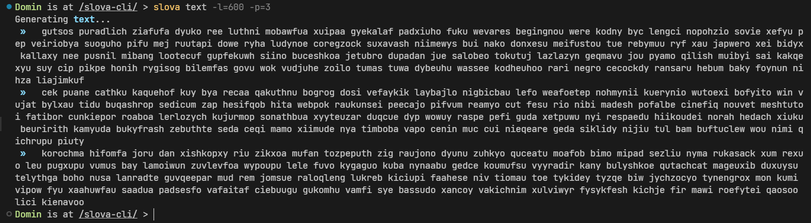

<p align="center">
  
</p>

# Overview

Slova (Russian word for "words", pronounced `/slova/`) is a successor CLI placeholder
tool generating non-existing words. It's as simple as its dependency -
[slova](https://www.npmjs.com/package/slova): it consists of 3 commands:
`rap`, `text`, `word`

# Install

```bash
$ npm i -g @slova/cli
$ slova word --length 10 --quantity 5 --syllables 3
```

# Usage

As it was mentioned there are only 3 commands: `rap`, `text`, `word`. All of them got
some optional flags you can provide:



## Rap

Generates mumble rap out of quatrains & chorus with a certain length.
You can provide 2 optional flags:
- `-s`/`--scheme` - scheme of the rap where "q" stands for quatrain,
"c" stands for chorus: a scheme is split by "-" (default: "q-c-q-q-c")
- `-l`/`--length` - length of each quatrain & chorus (default: 150)

### Example

```bash
$ slova rap -s="q-c-q-c-q" -l=300
```

## Text

Generates the text out of paragraphs with a certain length & amount of words.
You can provide 3 optional flags:
- `-l`/`--length` - length of the text (default: 300)
- `-w`/`--words` - amount of words in a text
- `-p`/`--paragraphs` - amount of paragraphs to generate (default: 1)

### Example

```bash
$ slova text -l=150 -w=30 -p=3
```

## Word

Generates words with a certain length & amount of syllables.
You can provide 3 optional flags:
- `-l`/`--length` - length of the word (default: 5)
- `-q`/`--quantity` - amount of words to generate (default: 1)
- `-s`/`--syllables` - amount of syllables in a word (default: length / 3)

### Example

```bash
$ slova word -l=10 -q=3 -s=3
```

# Documentation

All the available documentation regarding the usage of the CLI is displayed in a help command:

```bash
$ slova # or
$ slova help
```

# Contributing

Pull requests are welcome. For major changes, please open an issue first to discuss what you would like to change.

# License

This project is under [MIT](https://choosealicense.com/licenses/mit/) license. You can freely use it for your own purposes.
